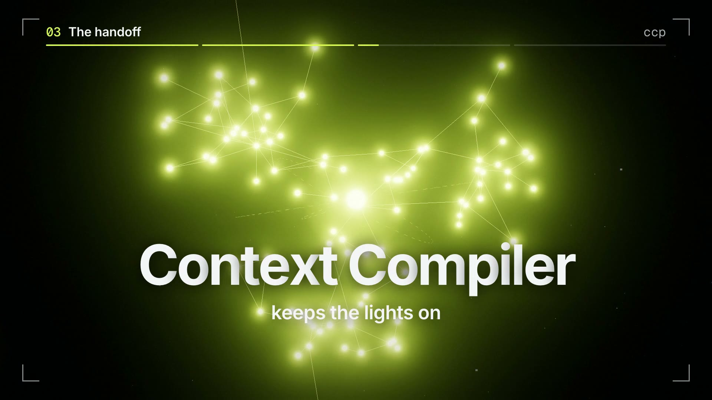
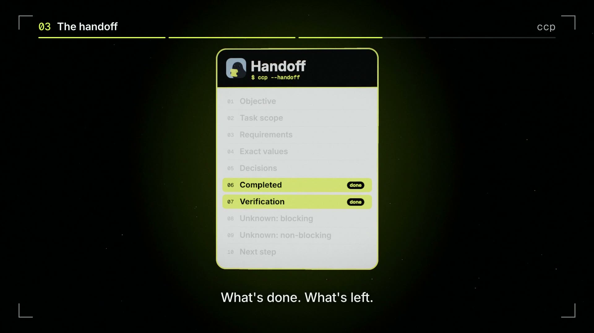

<p align="center">
  
</p>

<p align="center"></p>

<h1 align="center">Context Compiler</h1>

<p align="center">
  <strong>Hand an AI coding agent’s unfinished work to the next agent, without losing what it learned.</strong><br>
  <code>ccp</code> compiles your Claude Code session, git state and tool evidence into a structured handoff a fresh agent can act on.
</p>

<p align="center">
  <a href="https://github.com/swethankreddy/context-compiler/actions/workflows/ci.yml"></a>
  <a href="LICENSE"></a>
  
  <a href="https://swethankreddy.github.io/context-compiler/"></a>
  <a href="https://github.com/swethankreddy/context-compiler/releases/latest"></a>
</p>

---

## Why

A long coding session builds up knowledge the repository never keeps: what you asked for, what failed, the decisions made on the way, the exact values that mattered, what was verified and what is still open.
Every time your agent works, it builds a map in its head. When the session ends, is compacted, or hands over to another agent, the map goes dark, and the next agent starts in the dark.

Context Compiler keeps the lights on. It reads the session that ended and compiles the map into a handoff, so the next agent sees the map and picks up right where the last one stopped.

<p align="center"></p>

## Install

Requires **macOS**, **Node.js 22+**, and the **Claude Code CLI** (`claude`) installed and signed in.

```sh
npm install -g --install-links github:swethankreddy/context-compiler
```

The repository ships prebuilt JavaScript, so there is no build step. (`--install-links` makes npm copy the package instead of linking to a temporary clone.) Prefer a file? Each [release](https://github.com/swethankreddy/context-compiler/releases/latest) also has a `context-compiler-<version>.tgz`: `npm install -g ./context-compiler-0.1.0.tgz`.

Check it worked:

```sh
ccp --version
```

## Quick start

Run `ccp` from inside a project where you have been working with Claude Code.

```sh
# Write a handoff brief for a fresh agent that lacks the conversation
ccp --handoff

# Rebuild the task state after compaction or an interruption
ccp --recover

# Compile a short instruction against the current session, copied to your clipboard
ccp "fix the auth issue"

# See everything ccp discovered (nothing is sent anywhere)
ccp context
```

Paste the result into the new agent’s first message.

## What a handoff contains

The handoff is organised into sections the next agent can act on:

| Section | What it holds |
|---|---|
| Objective | What the work is for, in the developer’s own words |
| Task scope | What is in and out of scope |
| Requirements | Constraints the developer stated, including corrections |
| Exact values | Literal strings, names and numbers that must not drift |
| Decisions | Choices made during the session, and why |
| Completed | What is done |
| Verification | What was actually checked, with evidence |
| Unknown: blocking / non-blocking | What is still open, and whether it blocks progress |
| Next step | Where to pick up |

Facts are taken from the session transcript, git state and tool output, and keep their provenance. Anything that could not be established is reported as unknown instead of guessed.

## Commands

```text
ccp "instruction"              compile an instruction, copy to clipboard
ccp                            prompt for the instruction interactively
ccp context [--json]           show everything discovered (nothing is sent anywhere)
ccp context --selected "..." [--json] [--content]
                               show which context would be selected for an instruction

--handoff         write a handoff brief for a fresh agent (defaults to "Continue this task.")
--recover         rebuild the task state after compaction or an interruption
--preview         show the context summary and the instruction; do not copy
--print           write only the instruction to stdout (no progress output)
--no-copy         do not copy to the clipboard
--session <id>    use this Claude Code session instead of auto-detecting
--effort <level>  override the configured effort (low, medium, high, xhigh, max)
--show-input      print the compiler's system prompt, input and timings to stderr
-h, --help        show help
-v, --version     show version
```

## How it works

1. **Discover.** Finds the current Claude Code session for this project, plus git status, the working diff and project instructions (`CLAUDE.md` and similar).
2. **Select.** Scores and budgets the evidence: developer messages, corrections, tool results, test runs, edited files. The things that matter are kept; noise is compressed.
3. **Compile.** Sends only the selected, redacted evidence to your own authenticated `claude` CLI, and returns the brief.

## Privacy and safety

- **Your own Claude account.** Compilation runs through your authenticated `claude` CLI. `ccp` never reads your credentials.
- **Isolated compile call.** The call runs in a throwaway directory with no session persistence, no tools, no MCP servers, and no hooks, plugins or skills. It cannot act on your machine or become part of your session history.
- **Redaction first.** Secrets such as API keys, tokens and private keys are redacted before anything leaves your machine.
- **Untrusted content stays untrusted.** Text from files, tool output and pasted content is treated as data, not instructions.
- **Inspect before you send.** `ccp context` shows exactly what was discovered, and `--show-input` prints exactly what is sent.

## Configuration

Optional. Create `~/.context-compiler/config.yaml` to override the defaults (set `CCP_CONFIG_DIR` to use another folder):

```yaml
model:
  name: claude-opus-5-5
  effort: medium        # low | medium | high | xhigh | max
clipboard:
  enabled: true         # clipboard copy uses pbcopy (macOS)
```

## Development

```sh
git clone https://github.com/swethankreddy/context-compiler.git
cd context-compiler
npm install
npm run build   # dist/ is committed; rebuild after changing src/
npm test
```

## The film

A short film explains the idea in under 40 seconds: *every agent builds a map in its head; Context Compiler keeps the lights on.*
Watch it on the [latest release](https://github.com/swethankreddy/context-compiler/releases/latest) (`context-compiler-film.mp4`, 1920×1080).

## License

[MIT](LICENSE) © Swethank

Built by [Swethank](https://github.com/swethankreddy).
